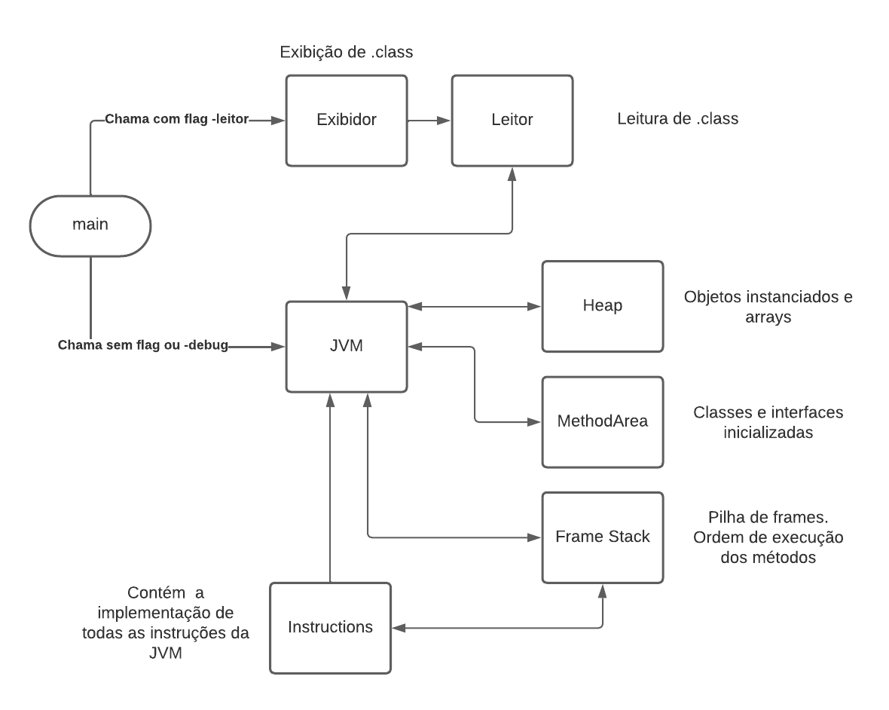

# JVM para a disciplina Software básico com o professor Ladeira

Documentação em /html/index.html

### Integrantes do grupo:

- Marcelo Piano - 200049496
- Marcelo Junqueira - 200023624
- Gabriel Borges - 202006401
- Maycon Fabio - 200059742
- Edson Sales - 190105399

---

# Como configurar o projeto

Rodar o comando `make` para compilar o projeto

# Como rodar o projeto

## Modo leitor-exibidor

`./jvmSB arquivo.class -leitor`

## Modo execução

`./jvmSB arquivo.class` (sem flags)

## Modo execução com debug

## `./jvmSB arquivo.class -debug`

# Organização do projeto

## Módulos:

### JVM

Se comunica com os outros módulos e gerencia a execução do programa.

### Common

Contém as estruturas de dados e funções comuns a quase todos os módulos.

### Leitor

Contém funções e estruturas de dados que permitem a leitura de arquivos .class e salvamento de suas informações.

### FrameStack

Contém funções e estruturas de dados que permitem executar os métodos na ordem correta, gerenciando a pilha de frames.

### Heap

Armazena os objetos e arrays instanciados da JVM, gerenciando o acesso e a alteração dos mesmos.

### MethodArea

Armazena e permite interação com as classes e interfaces carregadas na JVM.

### Exibidor

Contém as funções e estruturas de dados que permitem a exibição das informações contidas no .class.

### Instructions

Contêm a implementação das instruções da JVM.

---

# Pseudocódigo

### Inicialização:

1. Abre o arquivo selecionado com o leitor
2. Armazena as informações da classe no method area
3. procura main e a coloca na pilha de frames
4. Carrega classes super até chegar na object
5. Roda blocos estáticos (clinit) do object até a classe inicial (Coloca eles na pilha de frames)
6. Inicia loop de execução

### Loop de execução:

1. Pega o frame no topo da pilha
2. PC interno ao frame diz qual instrução do code é a próxima a ser executada
3. Identificar opcode e executar a operação correspondente
